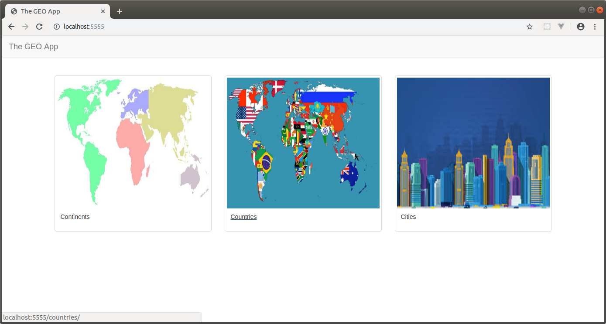
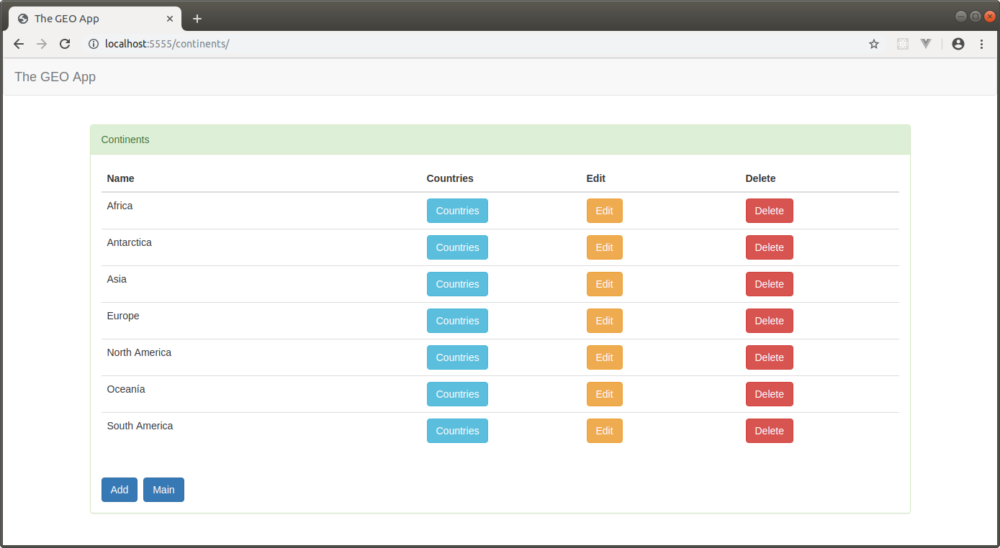
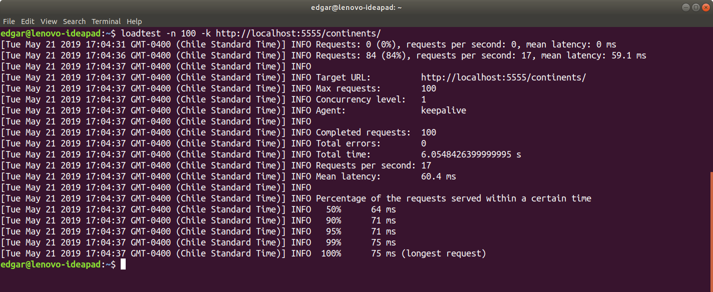
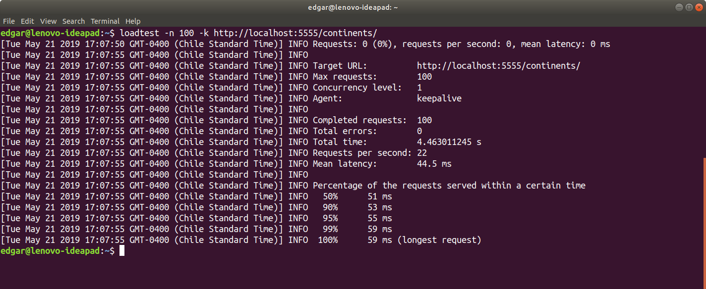

THE GEO APP
--------------------------------------------------------------------------------------------------------------------

Aplicación web desarrollada con Django 2.2 que almacena información de continentes, paises y ciudades.

La aplicación se conecta a una base de datos PostgreSQL utilizando las librerias psycopg2 y dj_database_url.

Se utiliza la librería django-redis para manejar la información de continentes, paises y ciudades en cache  
Redis, disminuyendo la cantidad de accesos a base de datos.

--------------------------------------------------------------------------------------------------------------------

En este proyecto se instaló la librería para redis "django-redis" y se modificó la siguiente configuración en archivo settings:

```python

CACHES = {
    'default': {
        'BACKEND': 'django_redis.cache.RedisCache',
        'LOCATION': 'redis://127.0.0.1:6379/',
        'OPTIONS': {
            'CLIENT_CLASS': 'django_redis.client.DefaultClient',
        }
    }
}

```

--------------------------------------------------------------------------------------------------------------------

Pantalla principal de la aplicación:



--------------------------------------------------------------------------------------------------------------------

Pantalla principal de la sección Continents:



--------------------------------------------------------------------------------------------------------------------

Se revisan las llaves almacenadas en Redis por medio de redis-cli:


--------------------------------------------------------------------------------------------------------------------

Si bien la cantidad de registros en la vista continentes es pequeña, al realizar la comparación de rendimiento 
con loadtest, la cache tiene una mejor performance que el acceso a base de datos: 





--------------------------------------------------------------------------------------------------------------------

Github repository:  https://brightdog@bitbucket.org/brightdog/the_geo_app